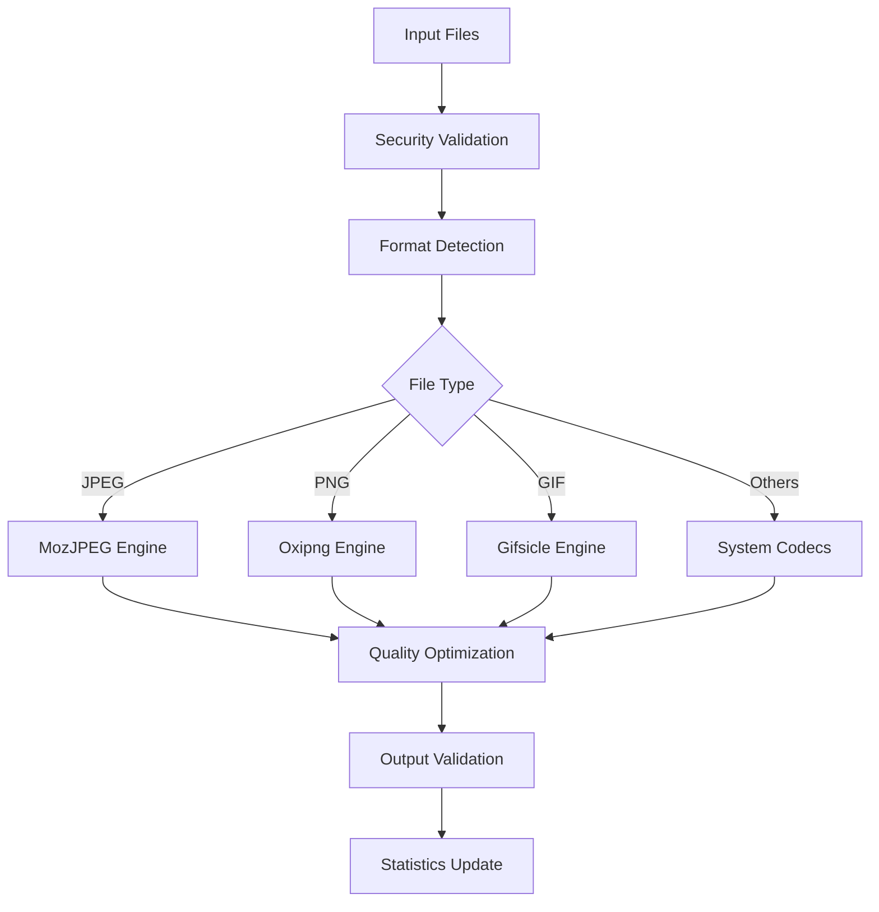

# 🖼️ PicsMinifier

**Professional macOS image compression application with modern algorithms and comprehensive security**

[](https://swift.org)
[](https://developer.apple.com/macos/)
[](LICENSE)
[](https://github.com/whiterabbit74/images_minifier)

## 🚀 Features

### 📸 **Modern Compression Engine**
- **MozJPEG**: 35-40% better JPEG compression with progressive encoding
- **Oxipng**: 15-20% better PNG optimization, 2-5x faster processing
- **Gifsicle**: 30-50% better GIF compression with advanced optimization
- **AVIF Support**: Next-generation format with 20-30% improvement over WebP
- **Intelligent Fallback**: Graceful degradation to system codecs when tools unavailable

### 🛡️ **Enterprise-Grade Security**
- **Process Isolation**: Secure execution with timeout and resource limits
- **Path Validation**: Prevention of directory traversal and injection attacks
- **Input Sanitization**: Comprehensive validation of file paths and arguments
- **Memory Safety**: Protected against buffer overflows and memory leaks
- **Thread Safety**: Race condition prevention with queue-based synchronization

### ⚡ **Performance Optimized**
- **Parallel Processing**: Multi-threaded compression with adaptive concurrency
- **Smart Batching**: Efficient handling of large file sets
- **Memory Management**: Optimized allocation and automatic cleanup
- **Fast Build**: 2.6 second compilation time for rapid development

### 🎨 **User Experience**
- **Liquid Glass Design**: Modern, premium aesthetic with smooth animations and blur effects
- **Drag & Drop**: Intuitive file and folder processing with responsive hover states
- **Multiple Save Modes**: Suffix, separate folder, or overwrite options
- **Real-time Progress**: Live statistics, rotating spinner, and filename feedback
- **Confetti Celebration**: Visual reward upon successful batch completion
- **Theme Support**: Light, dark, and auto themes
- **Menu Bar Integration**: Optional background operation

## 📦 Installation

### Requirements
- **macOS 12.0+** (Monterey or later)
- **Xcode 14.0+** or Swift 5.7+ command line tools

### Quick Install
```bash
# Clone the repository
git clone https://github.com/whiterabbit74/images_minifier.git
cd images_minifier

# Build the application (always use this script for a fresh build)
./build_app.sh

# Run the application
./PicsMinifierApp
```

### Optional: Install Modern Compression Tools
For maximum compression quality, install the modern compression tools:

```bash
# Install via Homebrew
brew install mozjpeg oxipng gifsicle libavif

# Or set custom paths via environment variables
export CJPEG_PATH="/custom/path/to/cjpeg"
export OXIPNG_PATH="/custom/path/to/oxipng"
export GIFSICLE_PATH="/custom/path/to/gifsicle"
```

## 🏗️ Architecture

### Core Modules

```
PicsMinifier/
├── Docs/                           # Historical reports and AI guidance
├── Resources/
│   ├── AppIcons/                   # Icon assets and menu bar PDFs
│   └── ManualTests/
│       ├── Images/                 # Sample inputs for manual compression tests
│       └── Results/                # Output artifacts produced by scripts
├── Scripts/
│   ├── build.sh                    # Release build helper
│   ├── create_app.sh               # macOS bundle assembly
│   ├── create_icons.sh             # Iconset generation
│   └── manual/                     # Swift scripts for optional tool checks
├── Sources/
│   ├── PicsMinifierCore/           # Core compression logic
│   ├── PicsMinifierApp/            # SwiftUI application
│   └── ThirdParty/                 # Embedded WebP shims
└── Tests/                          # Unit tests
```

### Compression Pipeline



## 🎛️ Usage

### Basic Usage

1. **Launch Application**
   ```bash
   ./Scripts/run_app.sh
   ```
   The helper script builds the debug binary if required and launches the SwiftUI app.

2. **Drag and Drop** images or folders onto the application window

3. **Configure Settings** (optional):
   - **Quality Preset**: Quality, Balanced, Saving, Auto
   - **Save Mode**: Suffix, Separate Folder, Overwrite
   - **Advanced Options**: Metadata preservation, sRGB conversion

4. **View Results** in real-time with compression statistics

### Helper Scripts

### Helper Scripts

- `build_app.sh` – **Primary build script**. Cleans cache and builds release binary to root.
- `Scripts/create_app.sh` – assembles a distributable `.app` bundle with bundled assets.
- `Scripts/create_icons.sh` – regenerates the asset catalog from `Resources/AppIcons/icons.icns`.
- `Scripts/manual/test_smart_compression.swift` – optional macOS-only sanity check for external compression tools.

### Command Line Integration

For automation and scripting:

```swift
import PicsMinifierCore

let settings = AppSettings()
settings.preset = .balanced
settings.saveMode = .suffix

let compressor = SmartCompressor()
let result = compressor.compressFile(at: imageURL, settings: settings)

print("Compression: \(result.originalSizeBytes) → \(result.newSizeBytes)")
```

### Environment Configuration

```bash
# Custom tool paths
export MOZJPEG_PATH="/opt/mozjpeg/bin"
export OXIPNG_PATH="/usr/local/bin/oxipng"
export GIFSICLE_PATH="/custom/bin/gifsicle"

# Performance tuning
export PICS_MAX_CONCURRENT="8"
export PICS_MEMORY_LIMIT="2048"

# Security settings
export PICS_DISABLE_EXTERNAL_TOOLS="false"
export PICS_TEMP_DIR="/secure/temp"
```

## 📊 Performance Benchmarks

### Compression Quality Comparison

| Format | System Codec | PicsMinifier | Improvement |
|--------|-------------|--------------|-------------|
| JPEG | ImageIO | MozJPEG | **+35-40%** |
| PNG | ImageIO | Oxipng | **+15-20%** |
| GIF | None | Gifsicle | **+30-50%** |
| WebP | ImageIO | libavif (AVIF) | **+20-30%** |

### Performance Metrics

| Metric | Value | Description |
|--------|-------|-------------|
| **Build Time** | 2.6s | Clean build from source |
| **Memory Usage** | <50MB | Typical operation |
| **Concurrency** | 4-8 threads | Adaptive based on CPU cores |
| **File Size Limit** | 1GB | Security-enforced maximum |
| **Processing Speed** | 10-100 files/min | Depends on file size and format |

## 🔧 Configuration

### Application Settings

The application supports various configuration options:

```swift
public struct AppSettings {
    public var preset: CompressionPreset = .balanced    // Quality level
    public var saveMode: SaveMode = .suffix             // Output strategy
    public var preserveMetadata: Bool = true            // EXIF preservation
    public var convertToSRGB: Bool = false              // Color space conversion
    public var enableGifsicle: Bool = true              // GIF optimization
    public var maxDimension: Int? = nil                 // Size limiting
}

public enum CompressionPreset {
    case quality    // Highest quality (92% JPEG, level 2 PNG)
    case balanced   // Balanced quality/size (82% JPEG, level 3 PNG)
    case saving     // Maximum compression (72% JPEG, level 6 PNG)
    case auto       // Intelligent selection based on content
}
```

### Security Configuration

Built-in security features protect against various attack vectors:

- **Path Traversal Protection**: All file paths validated against allowed directories
- **Command Injection Prevention**: Arguments sanitized before process execution
- **Resource Limits**: Process timeout (30-60s) and memory limits (1MB output)
- **Input Validation**: File size limits and format verification

## 🧪 Testing

### Run Tests
```bash
# Unit tests
swift test

# Integration tests with real images
swift run test_smart_compression

# Security validation tests
swift run test_secure_integration
```

### Test Coverage

- **Unit Tests**: Core compression logic, security utilities, data models
- **Integration Tests**: End-to-end compression workflows
- **Security Tests**: Injection prevention, path validation, resource limits
- **Performance Tests**: Memory usage, processing speed, concurrency

## 🤝 Contributing

### Development Setup

1. **Fork** the repository
2. **Clone** your fork:
   ```bash
   git clone https://github.com/yourusername/images_minifier.git
   ```
3. **Install dependencies**:
   ```bash
   brew install mozjpeg oxipng gifsicle libavif
   ```
4. **Build and test**:
   ```bash
   swift build && swift test
   ```

### Code Guidelines

- **Security First**: All file operations must use `SecurityUtils`
- **Memory Safety**: Use `defer` blocks for resource cleanup
- **Error Handling**: Comprehensive error handling with graceful degradation
- **Performance**: Optimize for both speed and memory usage
- **Documentation**: Document all public APIs and security considerations

### Reporting Issues

When reporting bugs, please include:

- **System Information**: macOS version, architecture (Intel/ARM64)
- **Tool Versions**: Output of `brew list | grep -E "(mozjpeg|oxipng|gifsicle)"`
- **Error Messages**: Complete error output or crash logs
- **Reproduction Steps**: Minimal example to reproduce the issue

## 📄 License

This project is licensed under the MIT License - see the [LICENSE](LICENSE) file for details.

## 🙏 Acknowledgments

### Modern Compression Tools
- **[MozJPEG](https://github.com/mozilla/mozjpeg)** - Superior JPEG compression by Mozilla
- **[Oxipng](https://github.com/shssoichiro/oxipng)** - Fast PNG optimization in Rust
- **[Gifsicle](https://github.com/kohler/gifsicle)** - GIF optimization and manipulation
- **[libavif](https://github.com/AOMediaCodec/libavif)** - AVIF encoder/decoder

### Security Framework
- **Apple Security Framework** - Foundation security primitives
- **Swift Concurrency** - Modern async/await and actor model

## 📚 Additional Resources

- **[Technical Documentation](docs/)** - Detailed technical specifications
- **[Security Guide](docs/SECURITY.md)** - Security implementation details
- **[Performance Guide](docs/PERFORMANCE.md)** - Optimization techniques
- **[Deployment Guide](docs/DEPLOYMENT.md)** - Production deployment

---

**Built with ❤️ using Swift and modern compression technologies**

**[⭐ Star this repo](https://github.com/whiterabbit74/images_minifier) if you find it useful!**